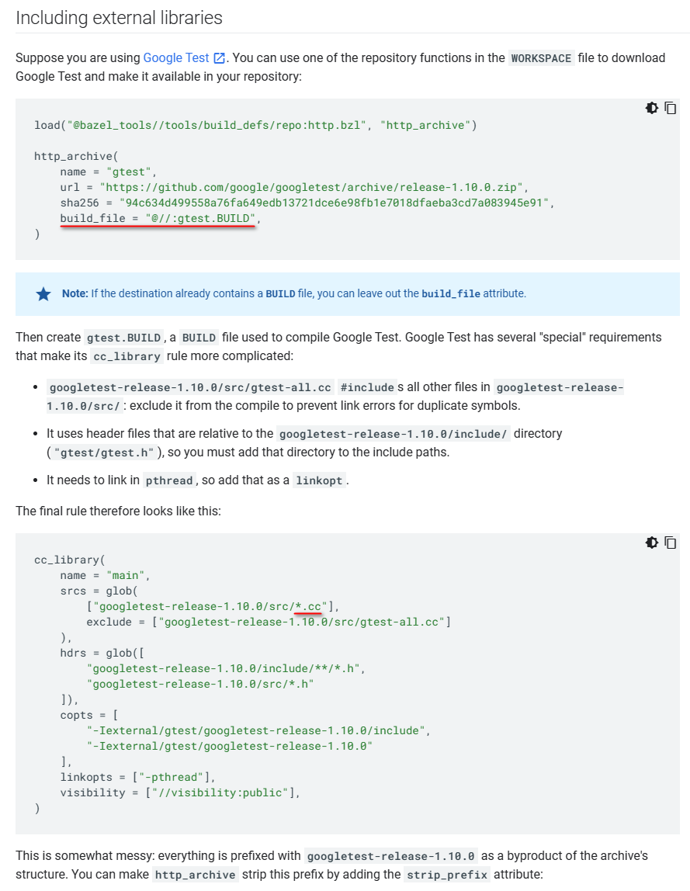
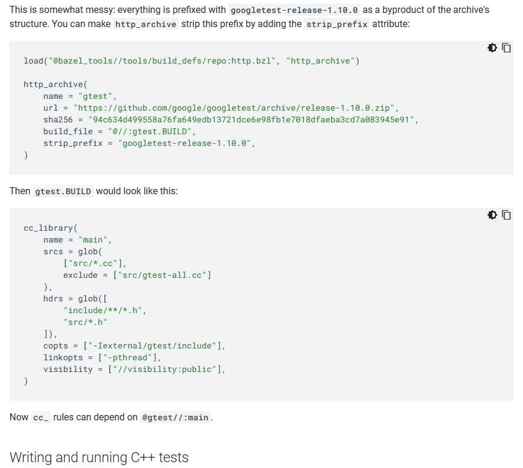

[2023-05-11] Jimm Chen:

This folder demonstrates today's Bazel doc problem from https://bazel.build/tutorials/cpp-use-cases .

It contains many-factor errors that would mislead newbie Bazel users.

The 'EG' in folder name implies "Error Guide".

Historical screenshot of Bazel guide below:

-

