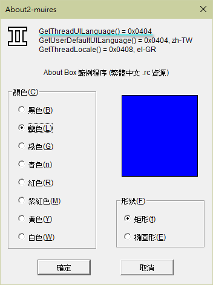

This program demonstrates that `SetThreadUILanguage()` can be called to assign which `LANGUAGE` should be picked when Windows is loading an .rc resource.

This project contains three .rc files, each has its distinct `LANGUAGE` statement and string text.

| Filename | LANGUAGE statement |
| -------- | ------------------ |
| 0409.rc  | LANGUAGE LANG_ENGLISH, SUBLANG_ENGLISH_US 
| 0804.rc  | LANGUAGE LANG_CHINESE, SUBLANG_CHINESE_SIMPLIFIED
| 0404.rc  | LANGUAGE LANG_CHINESE, SUBLANG_CHINESE_TRADITIONAL

These .rc files are stored in UTF16 with BOM, so that we do not have to write `#pragma code_page(xxx)` directive to indicate text-encoding within.

To make it compilable by VC2010, I have to use UTF16 with BOM, which is not friendly to some text tools like `git diff`. Later Visual Studio versions(VC2019 etc) allow us to encode them in UTF8 with BOM, which can be recognized by `git diff`.

From this program, I get to know the following facts.

If the program does not call `SetThreadUILanguage()`, Windows will use the LANGID from `GetUserDefaultUILanguage()` as actual resource `LANGUAGE` . To see this in effect, run `About2-muires.exe` with no parameter.

If the program call `SetThreadUILanguage(langid)` , Windows will use this *langid* as resource `LANGUAGE`. This can be verified by passing *langid* as parameter to `About2-muires.exe`.

`GetUserDefaultUILanguage()` indicates current Windows user-interface language(Windows display language). 

* In Windows XP through Windows 7, in order to see different `GetUserDefaultUILanguage()` value than the one default from Windows installation disc, we need to install the so called MUI language packs.
* In Windows 10, extra language packs can be installed online from Modern Windows Settings.

On English version of Windows, this program loads English resources:

On Windows with user-interface language set to Traditional Chinese, this program loads Traditional Chinese resources:

 

On English version of Windows, if I run `About2-muires.exe 0x0404` explicitly, I see Traditional Chinese resources as well:

BTW: As we can see, the value from another Windows API `GetThreadLocale()`, which defaults from intl.cpl user-locale selection, does NOT influence resource `LANGUAGE` picking in any way.

The above is at least true for Windows 7 and Windows 10, while older Windows XP seem to exhibit quite differently.

LANGID value and actual human-language mapping can be queried [here, with hex value](https://ss64.com/locale.html) or [here, Microsoft website](https://learn.microsoft.com/en-us/openspecs/office_standards/ms-oe376/6c085406-a698-4e12-9d4d-c3b0ee3dbc4a).

