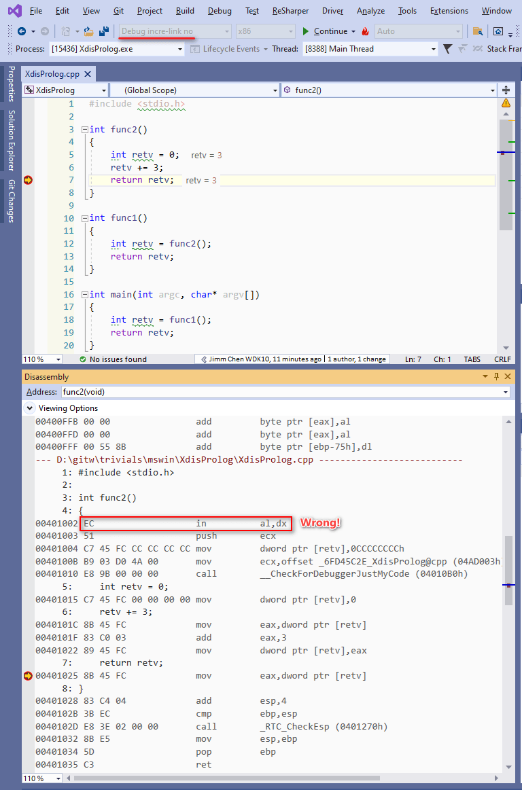
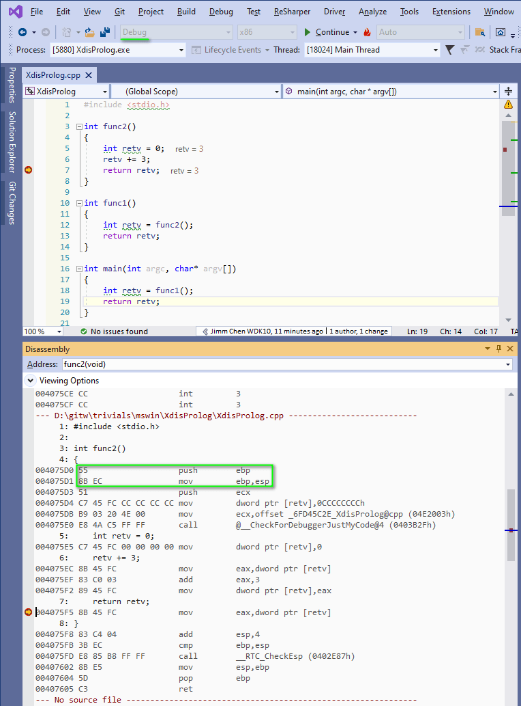

This .vcxproj shows a very weird behavior regarding Visual C++'s link option `/INCREMENTAL:NO` . 

This option is controlled in .vcxproj as `<LinkIncremental>false</LinkIncremental>` .

If we say `<LinkIncremental>true</LinkIncremental>` in .vcxproj, then VSIDE does NOT pass [`/INCREMENTAL`](https://learn.microsoft.com/en-us/cpp/build/reference/incremental-link-incrementally) to link.exe, which effectively means the default behavior is "INCREMENTAL linking is true".

BTW: In VC2019 16.11, explicitly passing `/INCREMENTAL:yes` will result in a warning saying:

    LINK : warning LNK4224: /INCREMENTAL:YES is no longer supported;  ignored

I find that `/INCREMENTAL:NO` causes a weired debugger behavior: Sometimes the debugger cannot correctly locate the first instruction of a function.

Experiment with Visual Studio 2019, 16.11, I see the following.

Set a breakpoint at line #7 below, F5 starts debugging and the debugger stops at L#7 automatically. Now we see the prolog of `func2` is NOT disassembled correctly.

With INCREMENTAL yes, we see correct disassembly behavior, like this:

But, with `/INCREMENTAL:NO`, if we stop at L#12, then F11 StepInto `func2`, we see that `func2` is disassembled correctly. Yes, the problem arises when we tell the debugger to plunge onto L#7 directly.

I'm wondering whether this is a bug in Visual Studio.
